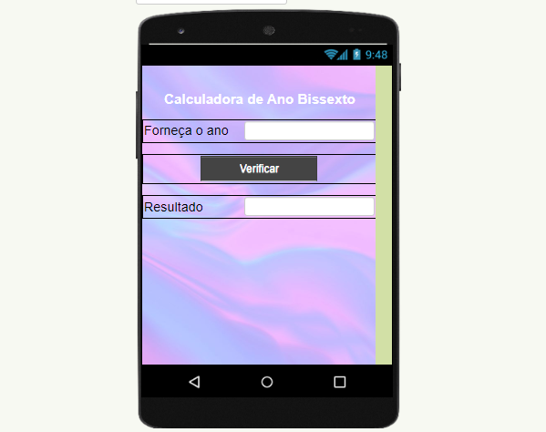

# Aplicativo para calcular se é Ano Bissexto

## Descrição
Esse é um aplicativo simples e intuitivo que permite aos usuários verificar se um determinado ano é bissexto ou não. Ele fornece uma maneira rápida e confiável de resolver essa dúvida comum.

## Funcionalidades:
- Verificação instantânea: Basta inserir o ano desejado e o aplicativo informará se é bissexto ou não.
- Interface intuitiva: Design limpo e fácil de usar, tornando a verificação de anos bissextos uma tarefa simples para qualquer usuário.
Como usar
- Insira o ano que você deseja verificar na caixa de texto.
- Clique no botão "Verificar".
- O aplicativo exibirá uma mensagem indicando se o ano é bissexto ou não.
- Como determinar se um ano é bissexto:

**Um ano é considerado bissexto se for divisível por 4. No entanto, anos divisíveis por 100 não são bissextos, a menos que também sejam divisíveis por 400. Por exemplo**

- 1600 e 2000 são anos bissextos.
- 1700, 1800 e 1900 não são anos bissextos.
- 2020 e 2024 são anos bissextos.
